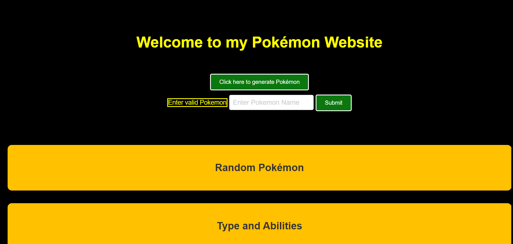

# Pokémon Website

## Overview

This repository contains the code and assets for a Pokémon website. The website allows users to generate random Pokémon images and display information about them. Additionally, users can manually search for specific Pokémon and view their attributes. The website also features a section for generating random Pokémon Amiibos.

## Table of Contents

- [Getting Started](#getting-started)
- [Features](#features)
- [Installation](#installation)
- [Usage](#usage)
- [Technologies Used](#technologies-used)
- [Contributing](#contributing)
- [License](#license)
- [Contact](#contact)

## Getting Started

To access the Pokémon website, simply open the `index.html` file in your preferred web browser. The website does not require any server setup or installation.
Here's how the website looks:

## Features

1. **Random Pokémon Generation:** Users can click on the "Click here to generate Pokémon" button to view a random Pokémon image along with its type and abilities.

2. **Manual Pokémon Search:** Users can enter the name of a specific Pokémon in the search box and click the "Submit" button to view the Pokémon's image, type, and abilities.

3. **Random Pokémon Amiibo Generation:** Users can click on the "Click here to generate one of 12 valid Pokémon Amiibo's" button to view a random Pokémon Amiibo image along with its release date.

## Installation

As mentioned earlier, there is no installation required for this website. Simply open the `index.html` file in your web browser to start using it.

## Usage

The website's main page (`index.html`) contains different sections for Pokémon and Amiibo. You can perform the following actions:

1. **Random Pokémon Generation:**
   - Click on the "Click here to generate Pokémon" button to view a random Pokémon image, type, and abilities.

2. **Manual Pokémon Search:**
   - Enter the name of a specific Pokémon in the search box.
   - Click the "Submit" button to view the Pokémon's image, type, and abilities.

3. **Random Pokémon Amiibo Generation:**
   - Click on the "Click here to generate one of 12 valid Pokémon Amiibo's" button to view a random Pokémon Amiibo image and its release date.
   - Note: The button is disabled after generating all 12 Pokémon Amiibos.

## Technologies Used

The Pokémon website is built using the following technologies:

- HTML: For creating the website structure.
- CSS: For styling the website with a black and yellow theme.
- JavaScript: For implementing the logic to fetch and display Pokémon and Amiibo data.
- [PokeAPI](https://pokeapi.co/): For fetching Pokémon data.
- [AmiiboAPI](https://www.amiiboapi.com/): For fetching Pokémon Amiibo data.

## Contributing

Contributions to this project are welcome! If you find any issues or have suggestions for improvement, feel free to open an issue or submit a pull request.

## License

This project is licensed under the [MIT License](LICENSE).

## Contact

If you have any questions or inquiries, you can contact the project owner:

- Name: Muhammad Rahman
- Email: mtayyibrahman@gmail.com

Thank you for using the Pokémon website! Enjoy exploring the world of Pokémon and Amiibos!
